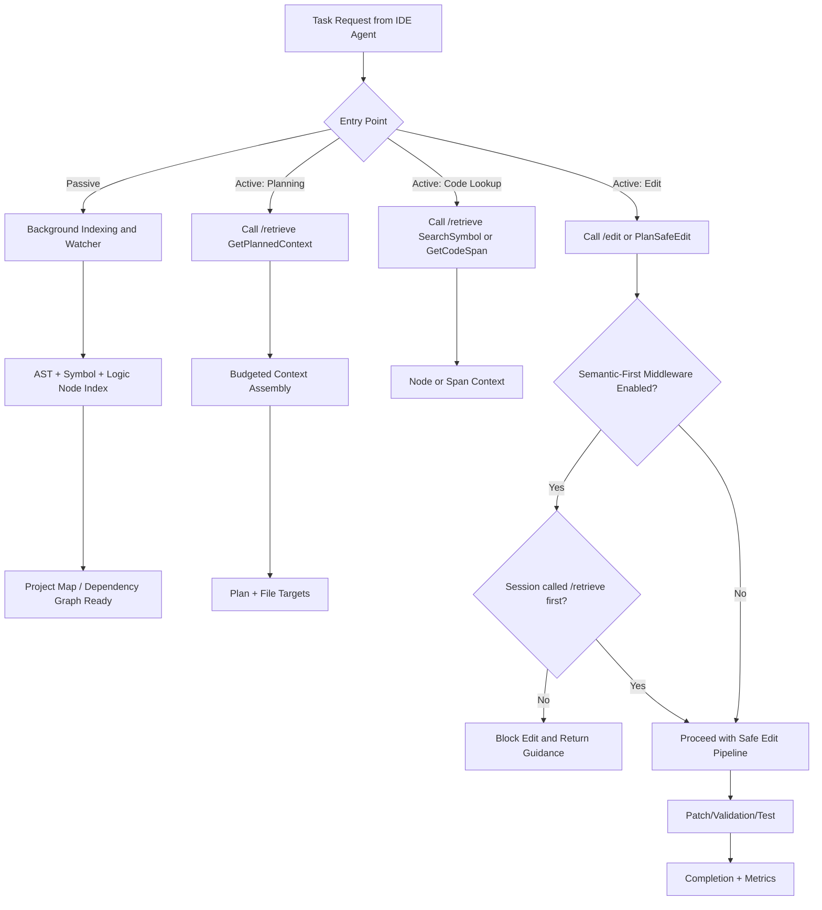

# IDE Agent Semantic-First Integration

To make IDE agents call semantic first (RooCode/KiloCode/Codex/Claude), use a policy + tool registration pattern.

## 1) Register Semantic Tools as First-Class Tools

- Register `/retrieve` operations as callable tools (`GetPlannedContext`, `GetCodeSpan`, `SearchSymbol`, `PlanSafeEdit`).
- Register MCP bridge tools (`/mcp/tools`, `/mcp/tools/call`) when the IDE supports MCP-native transport.
- Keep direct file read/write tools available, but route planning and code-context discovery through semantic first.

## 2) Enable Semantic-First Policy Middleware

- Endpoint: `GET /semantic_middleware`
- Endpoint: `POST /semantic_middleware` with:

```json
{
  "semantic_first_enabled": true
}
```

When enabled:

- `POST /retrieve` can accept `session_id` and marks the session as semantic-prepared.
- `PATCH /edit` requires the same `session_id` to have called `/retrieve` first.
- If no prior retrieve exists, edit is blocked with an actionable error.

Default posture in this project:

- semantic-first middleware enabled by default
- IDE entrypoint should be `POST /ide_autoroute`
- retrieval defaults to `reference_only=true`, with minimal raw seed attached for edit tasks
- legacy MCP tool aliases should be treated as compatibility shims; the bridge now routes them through `retrieve` or `ide_autoroute`

## 3) Development Lifecycle Entry Points



## 4) Where Token Savings Are Usually Highest

- Large codebases where full-file attachment is expensive.
- Multi-step tasks with repeated lookups across the same symbols/files.
- Sessions that reuse indexed context instead of repeatedly re-attaching raw files.
- Planning-heavy workflows where dependency/impact context avoids broad file dumps.

Recent benchmark note (2026-03-27):

- Primary metric is **step savings** (fewer developer iterations), not token savings.
- 2026-03-27: step savings = **+27.78%** (72 → 52 estimated steps), 11/11 success, avg retrieval 13 ms.
- Token cost is -6.73% (slightly more per call) but produces significantly fewer back-and-forth cycles overall.
- Prior hardening runs (2026-03-13): `+8.07%` and `+5.70%` token savings at `11/11` success.

## 5) When Token Usage Can Be Higher

This can still happen after optimization:

- Small single-file edits where semantic orchestration overhead dominates.
- Overly broad retrieval settings (`limit`, `radius`, high context token budgets).
- Repeated semantic calls when a single direct edit would be sufficient.
- Early-session cold start where indexing and first retrieval return more structure than needed.

What to monitor in `/ab_test_dev`:

- `gating_metrics.target_match_pct`
- `gating_metrics.empty_ref_pct`
- `gating_metrics.semantic_prompt_over_control_pct`
- `gating_metrics.escalation_attempt_pct`
- `quality_gates.validated_patch_success_pct`
- `quality_gates.tests_success_pct`
- `quality_gates.regression_alert`

Healthy signals:

- high `target_match_pct`
- near-zero `empty_ref_pct`
- low `semantic_prompt_over_control_pct`
- low escalation rate unless tasks are genuinely cross-file/complex

## 6) Practical Policy Defaults

- For clear single-file edits: set `single_file_fast_path=true`.
- Keep semantic-first enabled for planning, cross-file changes, and impact-sensitive edits.
- Keep compression off for precision-sensitive symbol/span retrieval, unless original user query is preserved and passed explicitly.
- Do **not** pass `session_id` manually — `ide_autoroute` auto-generates one and echoes it. Save and reuse `response.session_id` across calls.
- Do **not** call `GetCodeSpan` for spans already inlined in `ide_autoroute` response (`code_span` field present).
- Do **not** call `GetProjectSummary` manually on session start — auto-injected for repos ≥50 files.

## 7) Token-Saving Enhancements (2026-03-28)

The following optimisations reduce per-call token usage without degrading retrieval quality:

| Enhancement | Where | Effect |
|---|---|---|
| Compact JSON refs | `retrieval/src/lib.rs` prompt-building path | Removes whitespace from context refs in prompts |
| Short `context_phase` | `retrieval/src/lib.rs` response | `"fp_staged"` replaces verbose phase name |
| No `confidence_band` in response | `retrieval/src/lib.rs` context response | Removed from client JSON; retained in A/B test storage |
| `candidate_files/symbols` capped | `retrieval/src/lib.rs` | Max 5 entries in response arrays |
| No `module`/`priority` in prompt refs | `retrieval/src/lib.rs` | Stripped from `build_structured_context_refs` output |
| Session summary suppression | `api/src/main.rs` | Project summary injected once per session; null on repeat calls |
| Refs unchanged detection | `api/src/main.rs` | `refs_unchanged: true` signals LLM can skip re-reading context |
| Delta context mode | `api/src/main.rs` | Only changed refs returned when <5 refs differ from previous call |
| Tiered project summary | `project_summariser/src/lib.rs` | Nano/Standard/Full tiers; intent-driven tier selection |
| Symbol-scoped summary | `project_summariser/src/lib.rs` + `api/src/main.rs` | Modules filtered to target symbol + deps on Standard/Full tier |

## 7) Optional Add-On Modules (2026-03-28)

The following crates are now wired into `ide_autoroute` and the retrieval stack. All are opt-in by configuration and degrade gracefully if not configured.

| Add-on | Crate | What it enables | Config required |
|---|---|---|---|
| **LLM Router** | `llm_router` | Per-intent model routing. Sets `recommended_provider` + `recommended_endpoint` in every `ide_autoroute` response. Understand/chat → cheap model; debug/refactor → capable model. | `.semantic/llm_providers.toml`, `.semantic/llm_routing.toml`, `.semantic/llm_metrics.json` |
| **Impact Analysis** | `impact_analysis` | Pre-computes blast radius for debug/refactor/implement. Injects `impact_scope: {impacted_files, impacted_symbols, has_test_impact}` — eliminates 2-4 exploratory tool calls per session. | None (uses indexed storage) |
| **Knowledge Graph** | `knowledge_graph` | Persists design decisions, gotchas, refactor rationale as JSONL at `.semantic/knowledge_graph/knowledge.jsonl`. Injected as `knowledge_hints` on every `ide_autoroute` call. Writable via `AppendKnowledge` operation. | None (auto-created) |
| **Test Coverage** | `test_coverage` | Suppresses test files from context refs when target symbol already has coverage (understand/debug intents). Sets `test_coverage_suppressed: true` when active. | None (uses indexed storage) |
| **AST Cache** | `ast_cache` | In-memory cache of parsed tree-sitter trees keyed by file path + length. Eliminates redundant re-parsing within a process lifetime. | None (automatic) |
| **Change Propagation** | `change_propagation` | Cross-module impact diffusion via `GetChangePropagation` operation. Predicts downstream effects in workspace/monorepo setups. | Requires populated `org_graph` for multi-repo use |

### Configuring LLM Router

Create `.semantic/llm_providers.toml` with your provider endpoints (no keys in this file — use environment variables for secrets):

```toml
[providers]
anthropic = "<configure-endpoint>"
openai = "<configure-endpoint>"
openrouter = "<configure-endpoint>"
```

Create `.semantic/llm_routing.toml` to map task types to providers:

```toml
[planning]
preferred = ["anthropic", "openai"]

[execution]
preferred = ["openai", "openrouter"]

[interactive]
preferred = ["openrouter", "openai"]
```

Populate `.semantic/llm_metrics.json` with live performance data (or leave as `{}` to use preference order only):

```json
{
  "anthropic": { "latency_ms": 200, "token_cost": 0.3, "failure_rate": 0.005 },
  "openai":    { "latency_ms": 120, "token_cost": 0.5, "failure_rate": 0.01 }
}
```

### Using Knowledge Graph

Append entries via MCP:
```json
{"operation": "AppendKnowledge", "name": "auth middleware rewritten", "query": "design_decision", "edit_description": "Rewritten for compliance — session tokens must not be stored in plaintext", "file": "my-repo"}
```

Read entries:
```json
{"operation": "GetKnowledgeGraph"}
```

### Using Change Propagation

```json
{"operation": "GetChangePropagation", "name": "my-api-repo"}
```

Returns predicted propagation impact across dependent modules/repos.

## 8) Demo Project

The semantic repository includes a demo todo app used by A/B development tasks:

- `test_repo/todo_app/`
- Task suite file: `test_repo/todo_app/ab_test_suite_tasks.json`
