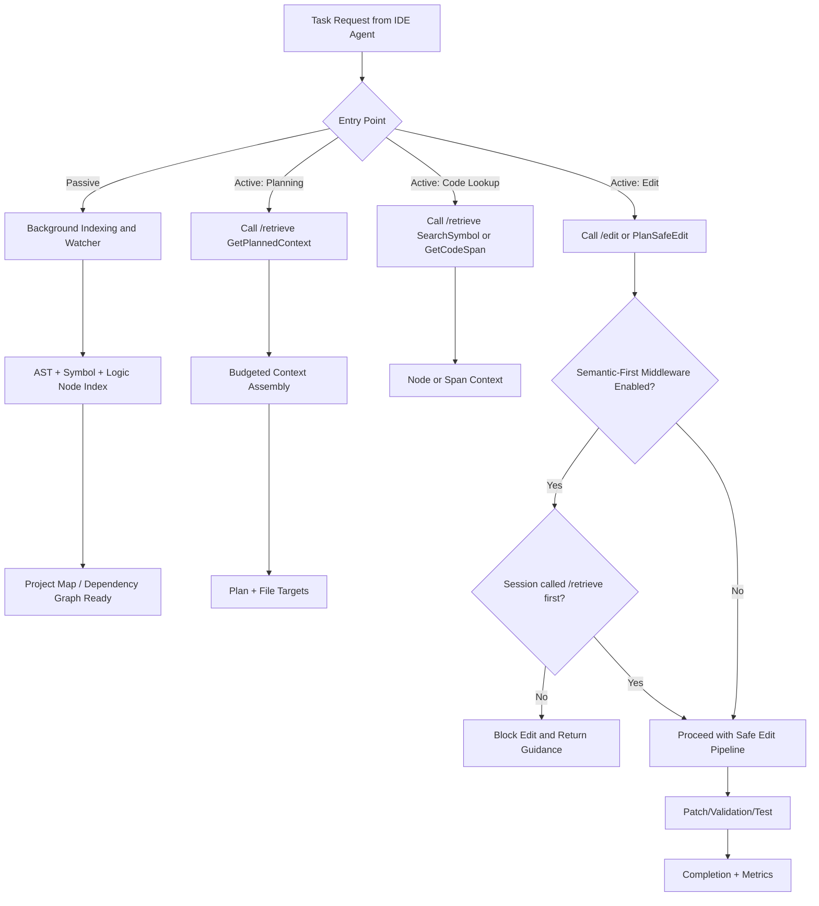

# IDE Agent Semantic-First Integration

To make IDE agents call semantic first (RooCode/KiloCode/Codex/Claude), use a policy + tool registration pattern.

## 1) Register Semantic Tools as First-Class Tools

- Register `/retrieve` operations as callable tools (`GetPlannedContext`, `GetCodeSpan`, `SearchSymbol`, `PlanSafeEdit`).
- Register MCP bridge tools (`/mcp/tools`, `/mcp/tools/call`) when the IDE supports MCP-native transport.
- Keep direct file read/write tools available, but route planning and code-context discovery through semantic first.

## 2) Enable Semantic-First Policy Middleware

- Endpoint: `GET /semantic_middleware`
- Endpoint: `POST /semantic_middleware` with:

```json
{
  "semantic_first_enabled": true
}
```

When enabled:

- `POST /retrieve` can accept `session_id` and marks the session as semantic-prepared.
- `PATCH /edit` requires the same `session_id` to have called `/retrieve` first.
- If no prior retrieve exists, edit is blocked with an actionable error.

Default posture in this project:

- semantic-first middleware enabled by default
- IDE entrypoint should be `POST /ide_autoroute`
- retrieval defaults to `reference_only=true`, with minimal raw seed attached for edit tasks

## 3) Development Lifecycle Entry Points



## 4) Where Token Savings Are Usually Highest

- Large codebases where full-file attachment is expensive.
- Multi-step tasks with repeated lookups across the same symbols/files.
- Sessions that reuse indexed context instead of repeatedly re-attaching raw files.
- Planning-heavy workflows where dependency/impact context avoids broad file dumps.

## 5) When Token Usage Can Be Higher

This can still happen after optimization:

- Small single-file edits where semantic orchestration overhead dominates.
- Overly broad retrieval settings (`limit`, `radius`, high context token budgets).
- Repeated semantic calls when a single direct edit would be sufficient.
- Early-session cold start where indexing and first retrieval return more structure than needed.

## 6) Practical Policy Defaults

- For clear single-file edits: set `single_file_fast_path=true`.
- Keep semantic-first enabled for planning, cross-file changes, and impact-sensitive edits.
- Keep compression off for precision-sensitive symbol/span retrieval, unless original user query is preserved and passed explicitly.

## 7) Demo Project

The semantic repository includes a demo todo app used by A/B development tasks:

- `test_repo/todo_app/`
- Task suite file: `test_repo/todo_app/ab_test_suite_tasks.json`
